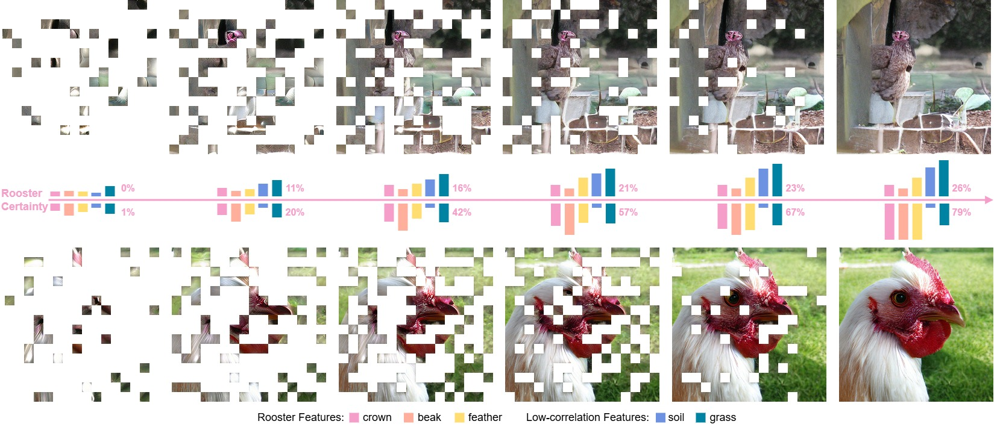
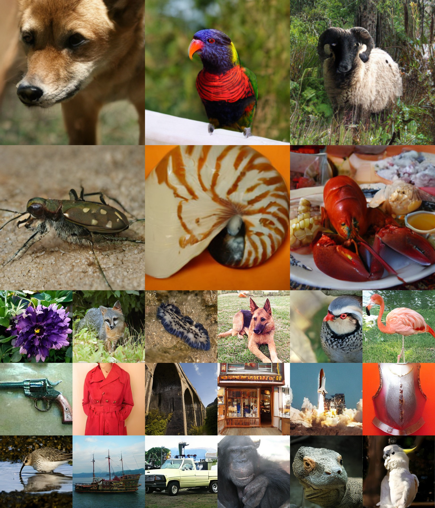
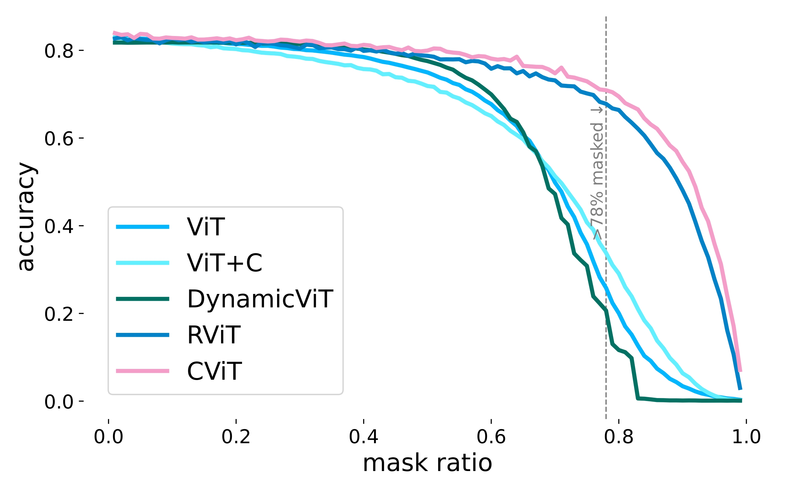

# The Collapse of Patches

    </img>
    

     Observing a particle <a href='https://en.wikipedia.org/wiki/Wave_function_collapse'>collapses its wave function</a>. Observing patches collapses an image's uncertainty. 
    <b style='color:#f59ec9'>How to uncover patches in an order that minimizes image uncertainty?</b>
    

     
    
We autoregressively generate rooster image patches following random order (above) and our <b style='color:#f59ec9'>collapse order</b> (below). The latter synthesizes prominent rooster features and reduces image uncertainty much more effectively.

## Abstract

Observing certain patches in an image reduces the uncertainty of others. Their realization lowers the distribution entropy of each remaining patch feature, analogous to collapsing a particle's wave function in quantum mechanics. This phenomenon can intuitively be called patch collapse. To identify which patches are most relied on during a target region's collapse, we learn an autoencoder that softly selects a subset of patches to reconstruct each target patch. Graphing these learned dependencies for each patch's PageRank score reveals the optimal patch order to realize an image. We show that respecting this order benefits various masked image modeling methods. First, autoregressive image generation can be boosted by retraining the state-of-the-art model MAR. Next, we introduce a new setup for image classification by exposing Vision Transformers only to high-rank patches in the collapse order. Seeing 22\% of such patches is sufficient to achieve high accuracy. With these experiments, we propose patch collapse as a novel image modeling perspective that promotes vision efficiency.

<b style='color:#f59ec9'> Our method studies the optimal scanning order of patches in image synthesis and classification.</b>

## Collapsed Image Generation

    </img>
    
Our method generates high-fidelity images across classes.

## Collapsed Image Classification

    </img>
    
Our CViT following collapse order outperforms baselines consistently along different mask ratios, achieving a high 70.6% top-1 classification accuracy when <b style='color:#f59ec9'>only 22% of the image is visible</b>. Please see papers for details.

## Implementation

Code will be released in December.

## References
We apply our method on the following models:

1. [MAR-B](https://github.com/LTH14/mar) by Li et al. for image synthesis.
2. [ViT-B-16](https://github.com/google-research/vision_transformer) by Dosovitskiy et al. for image classification.

Thank you for open-sourcing these great works!

